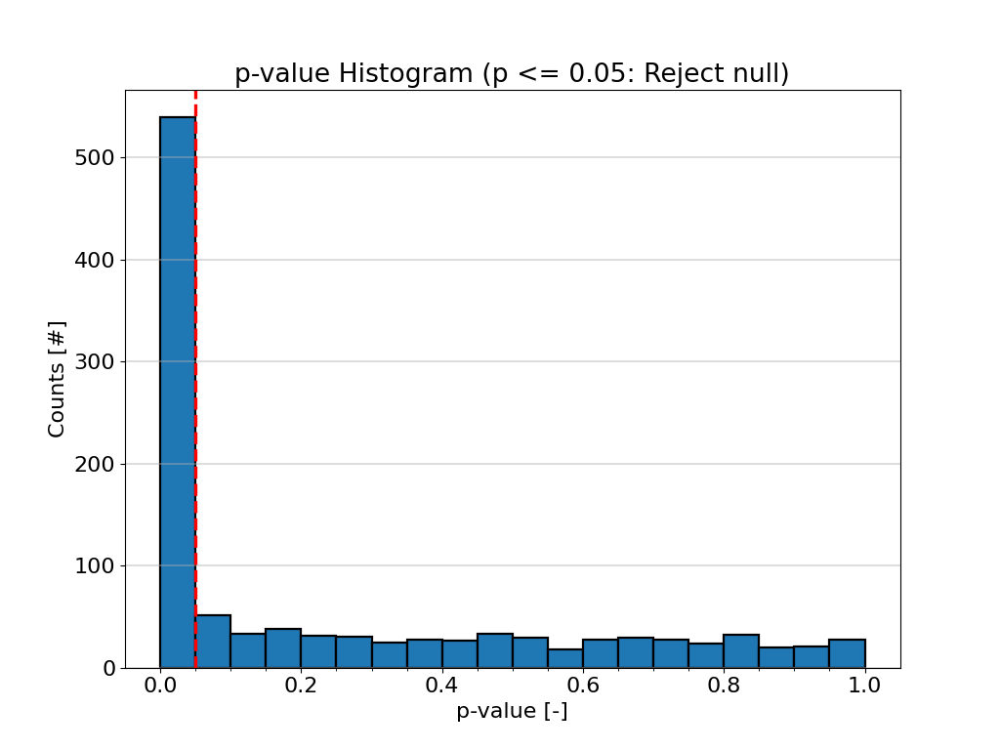
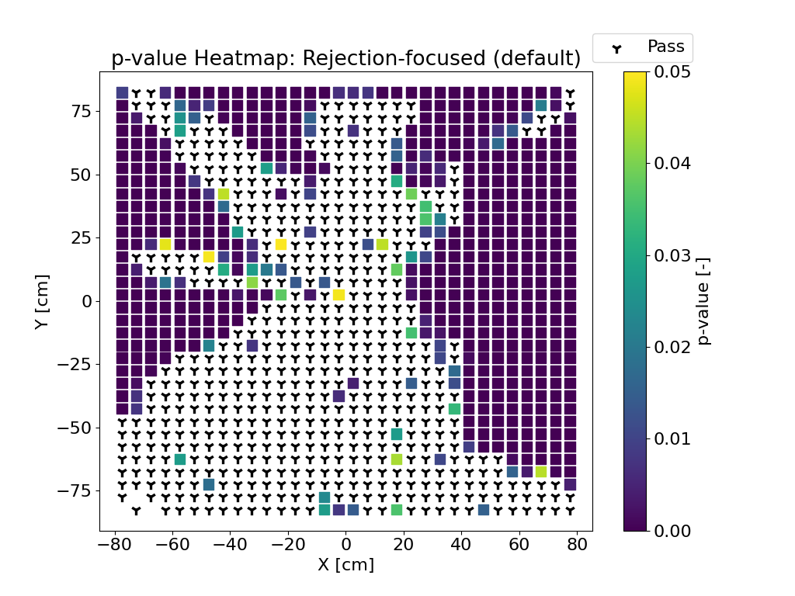
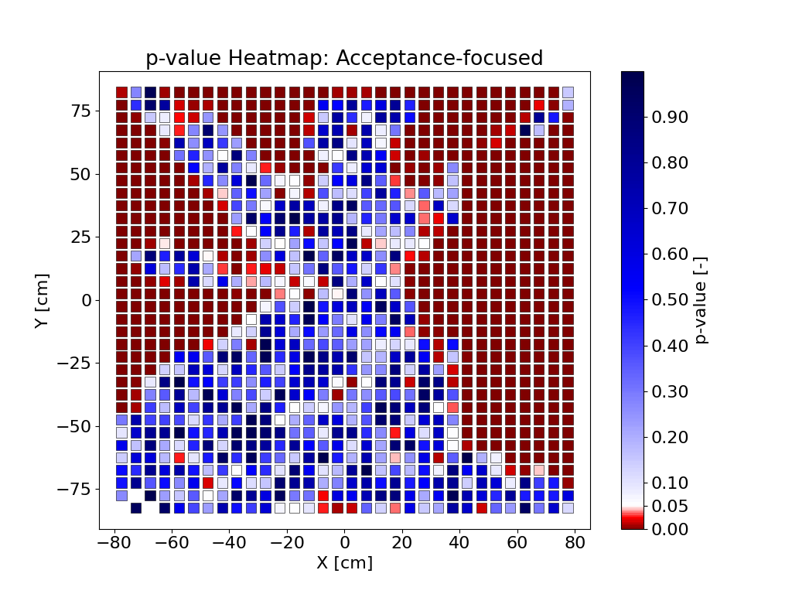

# t-test

This directory contains modules to run the t-test (also called Student's t-test)
on given sample data.

Primary purpose/feature of this work is to run an unpaired equal-variance
two-sample t-test on two sets of data.
This can be useful when one wants to determine whether or not there is a
statistically significant difference between the two sets.
Nuclear engineering relevant examples of such data include *k<sub>eff</sub>* and
tally results calculated by MCNP.

For background information on the t-test, read [Theory](THEORY.md).


## Running two-sample t-test

This section describes prerequisites, modules, scripts and tests related to
running two-sample t-test.


### Prerequisites

1. Determine a null and alternate hypothsis.

   The null and alternate hypothesis are pre-defined as following, and users
   only need to provide expected/known discrepancy between two distributions.
   Default: 0

   - *H<sub>0</sub>*: μ<sub>1</sub> - μ<sub>2</sub> = d
   - *H<sub>a</sub>*: μ<sub>1</sub> - μ<sub>2</sub> ≠ d

   where μ<sub>1</sub> is the mean of population 1, μ<sub>2</sub> is the mean of
   population 2, and d is the expected/known discrepancy between the two means.

2. Determine a significance level.

   Choose a significance level (α) for your t-tests. It will be used as a
   criterion for determining rejection/acception of the null hypothesis.
   Default: 0.05 (5 %)

3. Populate data loading/processing functions.

   Templates with input/output requirements are provided for functions
   `load_data`, `process_data` and `process_2dplot_input` in
   `twosample_ttest.py` module.
   Populate those functions according to your input data structure and desired
   t-test output, if you need preprocessing of your data or you're running
   `run_twosample_ttest.py` script.


### `twosample_ttest.py`

This is the main module for unpaired equal variance two-sample t-test,
located in `t_test` directory.
It contains the main function **t_test** that calls sub-functions and runs
t-tests, along with customizable data loading/processing and plotting functions.

Usage:

- Input:
  - `sample_1` & `sample_2`: Dictionary of {key: [Sample mean, Estimated standard
    error of the mean, sample size]} pair.
  - `alpha`: Significance level.
  - `d`: Set discrepancy between two input data, if any.
  - `skip`: Boolean to skip mismatching keywords.
- Output:
  - `stat`: Dictionary of {key, [t-vaue, degree of freedom, p-value,
    critical t-value, rejection boolean, RSEs]} pair.
- Example:
```python
from t_test import twosample_ttest as tt
stat = tt.t_test(sample_1, sample_2, alpha, d, skip)
```


### `run_twosample_ttest.py`

This is a wrapper script, located in `scripts` directory, that runs
`twosample_ttest.py`.

Usage:
- Command line arguments:
  - `filenames`: Input data filenames. Must be two strings.
  - `--alpha`(`-a`): Target significance level.
  - `--discrepancy`(`-d`): Set discrepancy between two data set.
  - `--skip`(`-s`): Skip mismatching data points instead of raising errors.
  - `--verbose`(`-v`): Verbosity level of t-test result.
  - `--plot`(`-p`): Plot type and filename.
- Example:
```shell
$ python3 t_test.py file1 file2 -a 0.01 -d 0.04 -s -v 2 -p histogram fig_h.png
```
→ Calculate t-statistic with significance level of 0.01 (or 1 %)
for each pair of data in `file1` and `file2` that are set to have discrepancy
of 0.04. Skip any mismatching data points. Display the number of pairs that
reject null hypothesis along with details of all rejected cases and relative
standard error of each case, and save a histogram of p-values in `fig_h.png`.


### `test_twosample_ttest.py`

This is a unit test file, located in `tests` directory, invoked by *pytest*
that tests main t-test running functions in `twosample_ttest.py`

Usage:
```shell
$ pytest tests/test_twosample_ttest.py -vvv
```


## Example output plots




